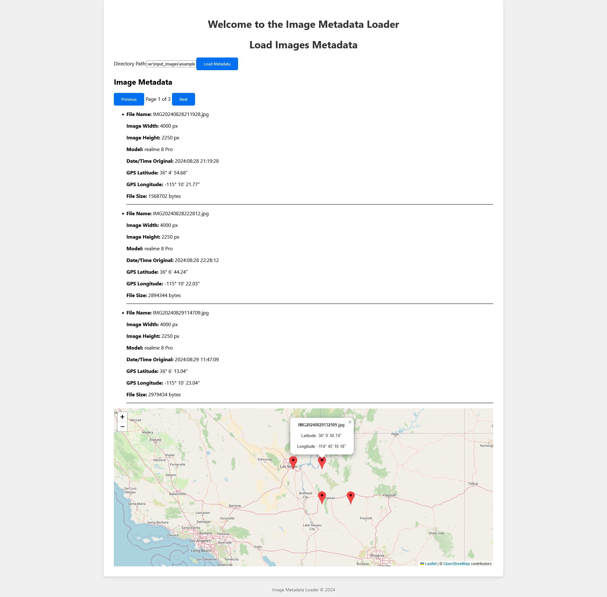

# PhotoMapper - Full Stack Application

PhotoMapper is a full-stack application that extracts and visualizes metadata from selected images. The backend processes the images and stores metadata, while the frontend provides an interactive map where users can view image information based on their location.

## Backend - Java Spring Boot Application
  
  
  


## Frontend - Next.js Application
  
  


## Project Structure
- **Frontend:** A Next.js application to display image metadata on an interactive map.
- **Backend:** A Spring Boot application to handle image metadata extraction and storage.

## Prerequisites
- **Java 21** for the backend
- **Node.js (20.x)** and **npm** for the frontend

## Application functions



## Running the Application
The application requires both the backend and frontend to be running.

### 1. Backend
Navigate to the `Backend` directory and start the application:
```bash
cd Backend
mvn clean package
java -jar target/PhotoMapperApplication.jar
```

### 2. Frontend
Navigate to the `Frontend/frontend` directory and start the Next.js application:
```bash
cd Frontend/frontend
npm install
npm run build
npm start
```

The frontend will be accessible on `http://localhost:3000` and the backend on `http://localhost:8081`.

---

## License
This project is licensed under the MIT License - see the [LICENSE](LICENSE) file for details.

